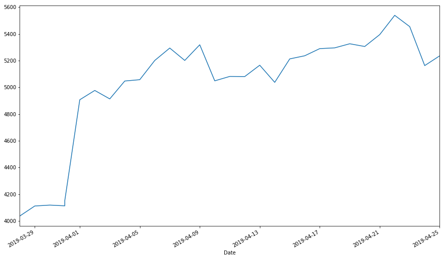

# Python 分析比特币价格

```python
# 导入模块及准备工作
from scipy import interpolate
import os
import datetime
import matplotlib.pyplot as plt
import numpy as np
import pylab as pl
import pandas as pd

get_ipython().run_line_magic('matplotlib', 'inline')
get_ipython().run_line_magic('pylab', 'inline')

pylab.rcParams['figure.figsize'] = (15, 9)
```

    Populating the interactive namespace from numpy and matplotlib

```python
start = datetime.datetime(2019, 3, 28)
end = datetime.datetime(2019, 4, 27)

df = pd.read_csv('BTC-USD2.csv')
# data['Adj Close'].plot(grid=True)
df['Date'] = pd.to_datetime(df['Date'])
df = df.set_index('Date')
frag = df['2019-3-28':'2019-4-25']
frag['Adj Close'].plot()
# plt.plot(frag['Adj Close'])

```

    <matplotlib.axes._subplots.AxesSubplot at 0x2d8d0a21828>



```python

```
