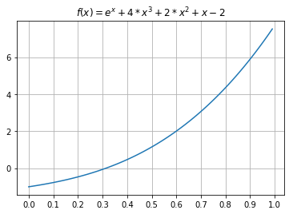

```python
# 内联显示matplotlib输出
%matplotlib inline
# 导入相关模块
import math
import matplotlib
import numpy as np
import matplotlib.pyplot as plt
from prettytable import PrettyTable
```

```python
# 绘制f(x)的图像
e = math.e

x = np.arange(0, 1, 0.01)

def f(x):
    y = e**x + 4*x**3 + 2*x**2 + x - 2
    return y

plt.figure(facecolor='white',edgecolor='white')

plt.xticks(np.arange(min(x), max(x)+1, 0.1))

plt.title('$ f(x) = e^x + 4*x^3 + 2*x^2 + x - 2 $')

plt.grid(True)

plt.plot(x, f(x))

plt.show()
```



## 2. 二分法求解 f(x)在[0, 1]区间上的根

```python
# 二分法求根

class FError(Exception):
    pass

def dichotomy(f, interval, error, m):
    '''二分法求方程根
    Args:
        f: 方程
        interval: 有根区间数组
        error: 允许的迭代误差
        m: 最大迭代次数

    Returns:
        如果在最大迭代次数内得到了满足要求的根, 则返回该值

    Raises:
        参数错误,超出最大迭代次数
    '''
    n = 0
    c = 0
    x = 0
    temp = 0

#     try:
    if 2 == len(interval):
        (a, b) = interval
        if (a > b):
            print(f'[{a}, {b}]区间无解')
            return
        if f(a)==0:
            return a
        if f(b)==0:
            return b
        if (f(a)*f(b)>0):
            print('f(a), f(b)同号')
            return

    table = PrettyTable(['迭代次数', 'a', 'b', 'x', 'f(x)'])

    while (n<m):
        plt.plot([a, b], [f(a), f(b)])

        if (b-a) < error:
            break

        # 取a,b中点x
        x = (a+b)/2

        y = f(x)

        table.add_row([n+1, a, b, x, y])

        # 若f(x)=0,返回x
        if f(x)==0:
            break
        # 取函数值异号两项作为新区间
        elif (f(x)*f(a)<0):
            b = x
        elif (f(x)*f(b)<0):
            a = x
        n += 1

    print(table)

x = np.arange(0, 1, 0.01)

plt.figure(facecolor='white',edgecolor='white')

plt.xticks(np.arange(min(x), max(x)+1, 0.1))

plt.title('$ f(x) = e^x + 4*x^3 + 2*x^2 + x - 2 $')

plt.grid(True)

plt.plot(x, f(x))

dichotomy(f, [0, 1], 10**-4, 20)

plt.show()

```

    +----------+-----------------+----------------+------------------+------------------------+
    | 迭代次数 |        a        |       b        |        x         |          f(x)          |
    +----------+-----------------+----------------+------------------+------------------------+
    |    1     |        0        |       1        |       0.5        |   1.1487212707001282   |
    |    2     |        0        |      0.5       |       0.25       |  -0.2784745833122586   |
    |    3     |       0.25      |      0.5       |      0.375       |  0.32217891461820125   |
    |    4     |       0.25      |     0.375      |      0.3125      | -0.0032792463262036886 |
    |    5     |      0.3125     |     0.375      |     0.34375      |  0.15277974586321097   |
    |    6     |      0.3125     |    0.34375     |     0.328125     |  0.07313118351443926   |
    |    7     |      0.3125     |    0.328125    |    0.3203125     |  0.03452725444645388   |
    |    8     |      0.3125     |   0.3203125    |    0.31640625    |  0.015525081793443807  |
    |    9     |      0.3125     |   0.31640625   |   0.314453125    |  0.006098281683223128  |
    |    10    |      0.3125     |  0.314453125   |   0.3134765625   | 0.0014033704793536828  |
    |    11    |      0.3125     |  0.3134765625  |  0.31298828125   | -0.0009394732466017075 |
    |    12    |  0.31298828125  |  0.3134765625  |  0.313232421875  | 0.00023156460100803855 |
    |    13    |  0.31298828125  | 0.313232421875 | 0.3131103515625  | -0.000354050303566833  |
    |    14    | 0.3131103515625 | 0.313232421875 | 0.31317138671875 | -6.126684935581217e-05 |
    +----------+-----------------+----------------+------------------+------------------------+


